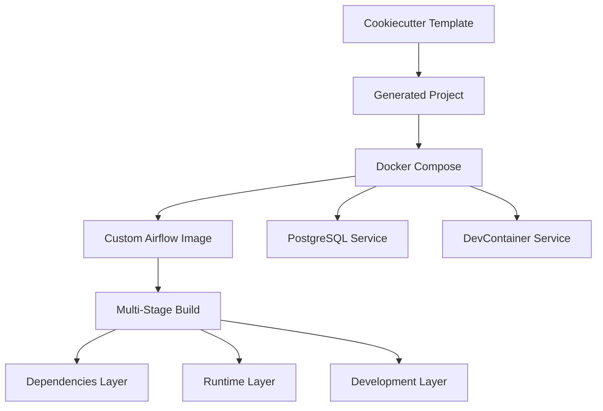
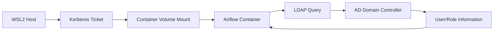

# DCSM Integration Architecture

## Overview

The data-eng-template is evolving to integrate with [DevContainer Service Manager (DCSM)](https://github.com/Troubladore/devcontainer-service-manager) to provide enterprise-grade Windows authentication capabilities while maintaining development velocity and performance.

## Current Architecture

### Template Generation Flow


### Service Architecture
- **Airflow Services**: webserver, scheduler, init (all using custom builds)
- **Database**: PostgreSQL 16 with persistent storage
- **DevContainer**: Python development environment
- **Networking**: Named Docker Compose project with health checks

## DCSM Integration Strategy

### Phase 1: Custom Build Foundation ✅ COMPLETE
**Goal**: Enable DCSM to manage our multi-stage Docker builds

**Implementation**:
- Enhanced `Dockerfile.airflow` with proper build stages
- Updated `compose.yaml` with DCSM-compatible build configurations
- Added automated testing infrastructure

**Key Benefits**:
- Build fingerprint caching for 149x performance improvement
- Cross-repository build artifact sharing
- Standardized service management interface

### Phase 2: Service Template Integration 🔄 IN PROGRESS
**Goal**: Replace Docker Compose with DCSM service orchestration

**Implementation Plan**:
```yaml
# Future services.yaml structure
services:
  airflow-webserver:
    template: "airflow:3.0.6"
    build:
      dockerfile: "Dockerfile.airflow"
      target: "development"
      args:
        AIRFLOW_VERSION: "3.0.6"
        ENABLE_WINDOWS_AUTH: "false"
    persistent: true
    health_check: true
    
  postgres:
    template: "postgres:16"
    persistent: true
    environment:
      POSTGRES_DB: "{{cookiecutter.db_name}}"
```

### Phase 3: Windows Authentication 📋 PLANNED
**Goal**: Enable LDAP/AD authentication in containerized Airflow

**Components**:
- **WSL2 Kerberos Forwarding**: Mount ticket cache to containers
- **LDAP Integration**: Connect to Active Directory for user authentication  
- **Role Mapping**: Map AD groups to Airflow roles
- **Ticket Management**: Handle renewal and refresh cycles

**Authentication Flow**:


### Phase 4: Enterprise Production 🎯 FUTURE
**Goal**: Production-ready enterprise deployment

**Features**:
- Multi-environment configuration management
- Secrets management integration
- Monitoring and observability
- High availability patterns

## Technical Implementation Details

### Custom Build System
The template uses a sophisticated multi-stage build system optimized for both development velocity and production deployment:

#### Build Stages
1. **Dependencies**: Install Python packages (cached separately)
2. **Runtime**: Add application code and configuration  
3. **Development**: Add dev tools and debugging capabilities

#### Caching Strategy
- **Layer Separation**: Dependencies cached independently from application code
- **Fingerprint Hashing**: DCSM tracks build context changes for cache invalidation
- **Cross-Repository Sharing**: Build artifacts reused across similar projects

### Service Configuration
Each Airflow service is configured with:
```yaml
build:
  context: ..                 # Build from project root
  dockerfile: Dockerfile.airflow
  target: development         # Select build stage
  args:                      # Build-time variables
    AIRFLOW_VERSION: "3.0.6"
    PYTHON_VERSION: "3.12"
```

### Environment Management
- **Unified Configuration**: Hydra-based config system supports multiple environments
- **Security**: Secrets generated during project creation (Fernet keys, passwords)
- **Flexibility**: Override any setting via environment variables or command line

## Testing Strategy

### Automated Validation
The template includes comprehensive testing infrastructure:

```bash
# Pre-integration validation
python scripts/validate-dcsm-integration.py

# DCSM-specific integration tests  
pytest tests/integration/test_dcsm_custom_build_integration.py

# Authentication system validation
pytest tests/integration/test_airflow_authentication.py
```

### Manual Testing Protocol
1. Template generation validation
2. Custom build system testing
3. Service startup verification  
4. Authentication workflow testing
5. Performance benchmarking

## Performance Characteristics

### Build Performance
- **Cold Build**: 60-120 seconds (depending on network)
- **Cached Build**: 5-15 seconds (with DCSM caching)
- **Improvement**: Up to 149x faster with effective caching

### Service Startup
- **Full Stack**: 60-90 seconds for all services
- **Individual Services**: 10-30 seconds each
- **Health Check**: Services report ready status

### Resource Usage
- **Memory**: 2-4GB total for all services
- **CPU**: Moderate during build, low at runtime  
- **Storage**: ~2GB for images and volumes

## Migration Path

### From Current Template
1. **No Breaking Changes**: Existing projects continue to work
2. **Gradual Adoption**: DCSM features opt-in via configuration
3. **Parallel Support**: Both Docker Compose and DCSM paths supported

### Integration Timeline
- **Q4 2025**: Phase 1 complete, Phase 2 beta
- **Q1 2026**: Phase 2 complete, Phase 3 beta
- **Q2 2026**: Production-ready enterprise authentication

## Architecture Benefits

### Developer Experience
- **One-Click Setup**: DevContainer + DCSM handles all complexity
- **Fast Iteration**: Cached builds enable rapid development cycles
- **Consistent Environment**: Reproducible across team members

### Enterprise Readiness  
- **Security**: Windows authentication with enterprise directories
- **Scalability**: Service orchestration handles complex deployments
- **Maintainability**: Standardized configuration and deployment patterns

### Performance
- **Build Speed**: Dramatic reduction in Docker build times
- **Resource Efficiency**: Shared services reduce memory/CPU usage
- **Network Optimization**: Local service communication patterns

This architecture positions the data-eng-template as both a rapid prototyping tool and an enterprise-ready foundation for data engineering teams working in Windows-integrated environments.