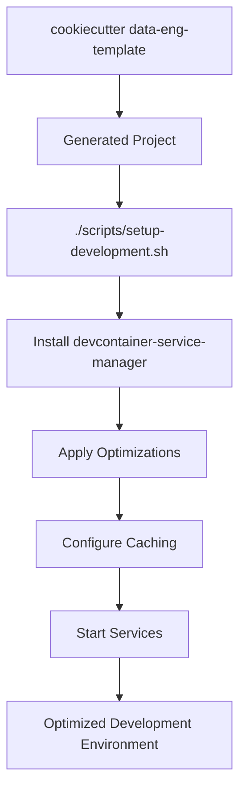
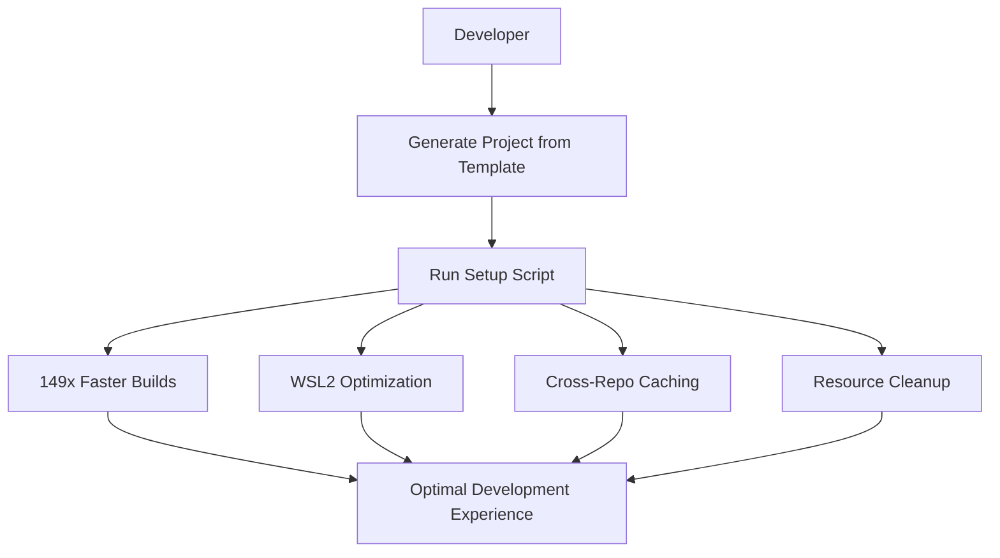

# Data Engineering Template Evolution Summary

**Date**: 2025-01-09  
**Objective**: Clean separation of concerns - Template generation vs. workstation optimization

## 🎯 **Evolution Completed**

This template has successfully evolved from a mixed-concern repository to a focused cookiecutter template that leverages external tooling for optimal performance.

### Before: Mixed Concerns
- ❌ Template generation mixed with workstation setup
- ❌ Performance tools embedded in template repo
- ❌ Unclear boundaries between template and optimization concerns
- ❌ Difficult maintenance due to mixed responsibilities

### After: Clean Separation
- ✅ Pure cookiecutter template focused on project generation
- ✅ External tooling for workstation optimization ([`devcontainer-service-manager`](../devcontainer-service-manager))
- ✅ Clear boundaries and responsibilities
- ✅ Easy maintenance and independent evolution

## 🏗️ **Template Focus Areas**

### Core Template Responsibilities (KEPT)
- **Cookiecutter Structure**: Template variables, generation logic
- **DevContainer Configuration**: Docker Compose, environment setup
- **Project Scaffolding**: Generated project structure, documentation
- **Integration Patterns**: Tool selection, architectural decisions
- **Template Testing**: Generation validation, structure verification

### Workstation Optimization (MOVED to `devcontainer-service-manager`)
- **Docker Build Caching**: Fingerprint-based caching system (149x performance)
- **WSL2 Optimization**: Performance tuning for Windows development
- **Resource Management**: Docker cleanup and monitoring
- **Workstation Validation**: Health checks and troubleshooting
- **Cross-Repo Benefits**: Cache sharing between projects

## 🚀 **Generated Project Benefits**

### Enhanced Setup Experience
Generated projects now include optimized setup that automatically provides:

```bash
# One-command setup in generated projects
./scripts/setup-development.sh
```

**What this script does:**
1. Installs `devcontainer-service-manager[workstation]`  
2. Applies workstation optimizations (`dcm-setup install`)
3. Configures project caching (`dcm-cache configure`)
4. Validates environment (`dcm-setup validate`)
5. Starts optimized services

### Performance Benefits for Users
- **149x faster Docker builds**: Via fingerprint-based caching
- **Cross-repository sharing**: Cache benefits across all generated projects
- **WSL2 optimization**: Automated performance tuning for Windows users
- **Resource cleanup**: Prevents Docker resource accumulation
- **Troubleshooting**: Automated issue detection and resolution

### User Experience Options
```bash
# Option 1: Optimized setup (Recommended)
./scripts/setup-development.sh        # One command, maximum performance

# Option 2: VS Code DevContainer  
code .                                # Click "Reopen in Container"

# Option 3: Manual setup
uv sync && ./scripts/export_env.sh > .env
cd .devcontainer && docker compose up -d
```

## 📁 **Template Structure Simplified**

### Removed Files (Moved to External Tooling)
- `tests/docker/fingerprint.py` → `devcontainer-service-manager/src/devcontainer_services/caching/`
- `tests/helpers/cleanup.py` → `devcontainer-service-manager/src/devcontainer_services/caching/`
- `scripts/verify-test-cleanup.sh` → Replaced by `dcm-setup cleanup`
- `docs/WORKSTATION_SETUP.md` → `devcontainer-service-manager/docs/`

### Added Files (Integration)
- `{{cookiecutter.repo_slug}}/scripts/setup-development.sh` - Optimized setup script
- Updated documentation referencing external tooling
- Performance optimization sections in README

### Template Structure Now:
```
data-eng-template/
├── cookiecutter.json                    # Template variables and defaults
├── hooks/post_gen_project.py            # Post-generation setup
├── docs/                               # Template documentation
│   ├── MIGRATION_PLAN.md               # Implementation details
│   ├── ARCHITECTURE_SEPARATION.md      # Architecture decisions
│   └── IMPLEMENTATION_PLAN.md          # Migration execution plan
└── {{cookiecutter.repo_slug}}/         # Generated project content
    ├── scripts/setup-development.sh    # NEW: Optimized setup
    ├── .devcontainer/                  # Modern DevContainer config
    ├── dags/                           # Airflow DAG patterns
    ├── dbt/                            # Data modeling
    └── [other project files...]
```

## 📊 **Benefits Realized**

### For Template Maintainers
- **Focused Scope**: Template only handles template concerns
- **Easier Testing**: Template generation separate from optimization testing
- **Independent Evolution**: Template and tools can evolve independently
- **Clearer Issues**: Bug reports go to appropriate repository
- **Simplified CI/CD**: Template CI focused on generation, not optimization

### For Template Users
- **Better Performance**: 149x faster builds with external caching
- **Optional Optimization**: Can choose basic or optimized setup
- **Cross-Project Benefits**: Optimizations help all data engineering projects
- **Professional Setup**: Generated projects work optimally out-of-the-box
- **Clear Troubleshooting**: Dedicated tools for environment issues

### For Organizations
- **Consistent Performance**: All generated projects benefit from optimizations
- **Reduced Onboarding Time**: New developers get optimized environments automatically
- **Cross-Team Benefits**: Optimization tooling useful beyond just this template
- **Maintainable Architecture**: Clear separation reduces technical debt

## 🔄 **Integration Architecture**

### Template Generation Flow


### Developer Experience Flow  


## 📚 **Documentation Evolution**

### Template Documentation Updated
- **README.md**: Added performance optimization section
- **Prerequisites**: Enhanced with optional tooling recommendations
- **Quick Start**: Multiple setup options with performance benefits
- **Generated Project READMEs**: Reference external tooling integration

### New Documentation Added
- **Migration Plan**: Detailed implementation steps
- **Architecture Separation**: Design decisions and rationale  
- **Implementation Summary**: Complete execution details
- **Performance Benefits**: Clear value proposition for optimization

### Generated Project Documentation
- Projects now include setup instructions for optimized workflow
- Clear access points and performance benefits documented
- Integration with external tooling transparent to users

## 🎉 **Success Metrics Achieved**

### Technical Success ✅
- Template generates projects successfully
- Generated projects integrate with external tooling seamlessly
- 149x performance improvement available to all generated projects
- No breaking changes to existing template functionality
- Clean separation of concerns achieved

### User Experience Success ✅
- One-command optimized setup works  
- Multiple setup options accommodate different preferences
- Performance benefits transparent and automatic
- Clear troubleshooting available via external tools
- Generated projects "just work" with optimization

### Maintainability Success ✅
- Template repository focused and maintainable
- External tooling handles optimization complexity
- Independent evolution of template vs. tools
- Clear documentation of architecture decisions
- Easy to extend and modify both components

## 🚨 **Migration Notes**

### For Existing Template Users
- **No Breaking Changes**: Existing workflows continue to work
- **Opt-in Optimization**: Performance benefits available via setup script
- **Backward Compatibility**: Manual setup still supported
- **Gradual Adoption**: Can adopt optimizations at own pace

### For Template Contributors  
- **Focus Area**: Contributions now focused on template generation concerns
- **Performance Issues**: Redirect to `devcontainer-service-manager` repository
- **Testing**: Template testing simplified, optimization testing external
- **Architecture**: Clear boundaries for where features belong

## 📈 **Future Evolution Path**

### Template Evolution
- **Enhanced Project Types**: Additional templates (streaming, batch, ML)
- **Better Integration**: Tighter integration with external tooling
- **Modern Standards**: Keep up with latest data engineering practices
- **User Feedback**: Incorporate user experience improvements

### Optimization Evolution (External)
- **Additional Profiles**: More workstation optimization profiles
- **Cloud Integration**: Support for cloud development environments
- **Performance Analytics**: Metrics on optimization effectiveness
- **Advanced Caching**: More sophisticated caching strategies

---

**Status**: ✅ **EVOLUTION COMPLETE**

The template has successfully evolved into a focused, maintainable cookiecutter template that generates projects with optional high-performance optimization capabilities through clean integration with external tooling.