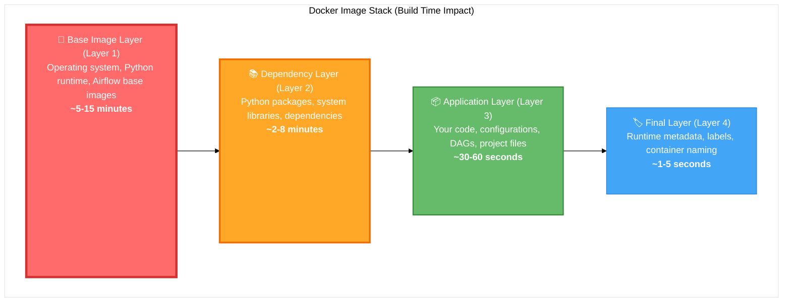

# Template Configuration Guide

## 🎯 **Understanding Configuration Choices and Their Impact**

This guide explains every configuration option in the cookiecutter template, organized by the same topics as `company-template-defaults.yaml`. Use the overview tables to understand settings at a glance, then drill into detailed breakdowns for specific choices.

### Docker Build Layer Caching

Understanding Docker's 4-layer caching system is critical for optimal build performance:

**Layer Impact Analysis:**

| Layer | What Lives Here | Build Time | Cache Sharing Impact |
|-------|----------------|------------|---------------------|
| **🐧 Layer 1 (Base)** | OS + Python + Airflow runtime | **5-15 min** | **CRITICAL** - Different versions break ALL caching |
| **📚 Layer 2 (Dependencies)** | pip packages, system libraries | **2-8 min** | **CRITICAL** - Package changes invalidate everything above |
| **📦 Layer 3 (Application)** | Your code, DAGs, configs | **30-60 sec** | **HIGH** - Code changes only rebuild this + Layer 4 |
| **🏷️ Layer 4 (Final)** | Labels, metadata, naming | **1-5 sec** | **LOW** - Cosmetic changes, minimal impact |

**Cache Impact Degrees:**
- **Critical** - Affects foundational layers (1-2), complete cache invalidation across team
- **High** - Affects multiple layers (2-3), significant rebuild performance impact
- **Moderate** - Affects specific layers (3-4), localized rebuild requirements
- **Low** - Affects final layers only (4), minimal performance impact
- **None** - Runtime/documentation only, no build layer impact

---

## 🚨 **Required Prompts (Cannot Be Defaulted)**

These three settings must be answered for every project generation:

| Setting | Short Description | Format | Examples/Choices | Suggested Default |
|---------|-------------------|--------|------------------|-------------------|
| **`customer_slug`** | Project identifier used throughout system | kebab-case | `customer-analytics`, `fraud-detection`, `user-segmentation` | Project-specific |
| **`description`** | Brief project summary for documentation | Free text | "Customer analytics pipeline", "Fraud detection system" | Project-specific |
| **`deployment_mode`** | Container naming strategy for environment isolation | Choice list | `production`, `testing` | `production` |

<strong>customer_slug</strong> 

> **The customer_slug is the fundamental identifier that flows through every aspect of your generated project.** It becomes container names, database names, directory paths, and Docker image tags. While seemingly simple, this choice affects project organization, team coordination, and operational clarity.
>
> **Format requirements:** lowercase letters, numbers, and hyphens only—no spaces, underscores, or special characters.

| Example | Why This Works | Caching Impact | Isolation Impact |
|---------|----------------|----------------|------------------|
| `customer-analytics` | Clear business domain, follows kebab-case convention, descriptive without being verbose | **Low - Final layer only** - Only affects image tags and container names in the final cosmetic layer | **Critical - Complete namespace separation** - Each slug gets separate containers, volumes, networks |
| `fraud-detection` | Domain-focused naming, uses standard separators, immediately recognizable purpose | **Low - Final layer only** - Project naming doesn't impact underlying build layers or component caching | **Critical - Complete namespace separation** - Prevents any resource conflicts between projects |
| `user-segmentation` | Business-aligned terminology, proper format, indicates data scope clearly | **Low - Final layer only** - Infrastructure and dependency caching unaffected by project naming | **Critical - Complete namespace separation** - Operational isolation across all Docker resources |

<strong>description</strong> 

> **The description provides human-readable context for your project,** appearing in documentation, README files, and project metadata. This is your opportunity to clearly communicate the project's business purpose and scope to team members and stakeholders.
>
> **Format:** free text, typically 1-2 sentences describing the project's business purpose.

| Example | Why This Works | Caching Impact | Isolation Impact |
|---------|----------------|----------------|------------------|
| "Customer analytics pipeline" | Concise business purpose, clear data domain, indicates pipeline nature | **None** - Pure documentation, no impact on any build layers | **None** - Documentation only |
| "Real-time fraud detection system" | Specifies real-time requirement, clear security domain, system-level scope | **None** - Documentation metadata only | **None** - No operational impact |
| "User behavior segmentation ML" | Indicates ML workload, specifies data type, clear analytical purpose | **None** - No influence on Docker layers or caching | **None** - Documentation artifact only |

<strong>deployment_mode</strong> 

> **Deployment mode controls the container naming strategy to enable parallel development workflows.** This is critical for teams running multiple projects simultaneously, CI/CD pipelines, and isolating experimental work from production-bound projects.

| Choice Value | Definition | When to Use | Caching Impact | Isolation Impact |
|--------------|------------|-------------|----------------|------------------|
| `production` 
(default)
 | Standard container names create predictable, clean operational environment for permanent projects | Permanent projects requiring clean, stable container naming without suffix conflicts | **Moderate - Namespace separation** - Production and testing use different Docker image caches for complete separation | **High - Standard namespace** - Clean, permanent container names without conflicts |
| `testing` 
 
 | `-test` suffix provides complete isolation for experiments, CI/CD, and temporary development work enabling parallel development workflows | Experiments, CI/CD pipelines, temporary development work, or any scenario requiring complete isolation from production containers | **Moderate - Namespace separation** - Testing containers completely isolated from production images ensuring no cache conflicts | **Critical - Complete isolation** - No conflicts with production containers during parallel development workflows |

---

## ⚡ **Critical Caching Settings**

These settings have **massive impact** on Docker build performance. Misalignment across team members causes complete cache invalidation.

| Setting | Short Description | Format | Examples/Choices | Suggested Default |
|---------|-------------------|--------|------------------|-------------------|
| **`python_version`** | Python runtime version for all containers | Version number | `3.11`, `3.12`, `3.13` | `3.12` |
| **`airflow_version`** | Airflow runtime version | Astronomer version | `3.0.6`, `3.0.7`, `2.10.2` | `3.0.6` |
| **`postgres_version`** | PostgreSQL database version | Major version | `15`, `16`, `17` | `16` |

<strong>python_version</strong> 

> **The Python version forms the foundation of every Docker image in your project.** This choice affects the base OS layer, system dependencies, package installation layers, and compatibility with your data processing libraries. Team alignment on this setting is absolutely critical for Docker layer sharing efficiency.
>
> **⚠️ Critical requirement:** all team members MUST use the same Python version or Docker layer sharing fails completely across the entire development workflow.

| Choice Value | Definition | When to Use | Caching Impact | Isolation Impact |
|--------------|------------|-------------|----------------|------------------|
| `3.11` 
 
 | Mature stability for legacy compatibility requirements, well-tested ecosystem | Legacy compatibility requirements or environments requiring proven stability | **Critical - Layers 1-4** - Different from team standard breaks ALL layer sharing for every build | **None** - Runtime choice only |
| `3.12` 
(default)
 | Current stable release with performance improvements and modern features, optimal for new projects | New projects requiring modern Python features with proven stability | **Critical - Layers 1-4** - Foundation for ALL containers, must match across entire team | **None** - No operational isolation impact |
| `3.13` 
 
 | Latest features and performance optimizations, cutting-edge development capabilities | Cutting-edge development requiring newest Python features | **Critical - Layers 1-4** - Different from team standard invalidates ALL cached layers | **None** - Runtime configuration |

<strong>airflow_version</strong> 

> **Airflow version determines the orchestration runtime, available features, and compatibility with your DAG patterns.**
>
> This choice affects the largest Docker layers (2GB+ base image), scheduler behavior, and API compatibility. Version coordination across your team is essential for build performance and feature consistency. Critical requirement: team must coordinate Airflow version changes to maintain Docker layer sharing efficiency across all projects.

| Choice Value | Definition | When to Use | Caching Impact | Isolation Impact |
|--------------|------------|-------------|----------------|------------------|
| `2.10.2` 
 
 | Mature Airflow 2.x series with proven stability for existing workflows | Existing Airflow 2.x workflows requiring stability and proven compatibility | **Critical - Layers 1-2** - 2GB+ base image, version changes invalidate all Airflow-related layers | **None** - Runtime choice only |
| `3.0.6` 
(default)
 | Latest stable Airflow 3.0 release with modern features and performance improvements | New projects requiring modern Airflow 3.0 features with proven stability | **Critical - Layers 1-2** - Must align with team for sharing 2GB+ of cached layers | **None** - No isolation impact |
| `3.0.7` 
 
 | Newest features and fixes, requires coordinated team upgrade for optimal caching | Cutting-edge Airflow features requiring latest capabilities and fixes | **Critical - Layers 1-2** - Version changes break ALL Airflow-related layer sharing across team | **None** - Runtime configuration |

<strong>postgres_version</strong> 

> **PostgreSQL version affects database container initialization, extension compatibility, and SQL feature availability.**
>
> While having less cache impact than Python or Airflow, version consistency still matters for database schema compatibility and initialization script caching. Stability focus: version 16 provides good balance of features and stability for most data engineering workloads.

| Choice Value | Definition | When to Use | Caching Impact | Isolation Impact |
|--------------|------------|-------------|----------------|------------------|
| `15` 
 
 | Proven stability for environments requiring PostgreSQL 15 compatibility | Legacy environments or applications specifically requiring PostgreSQL 15 compatibility | **Moderate - Layer 2** - Database container initialization and extension installation layers | **None** - Database runtime only |
| `16` 
(default)
 | Current stable release with good balance of features, performance, and stability | Most production environments requiring balance of stability and modern features | **Moderate - Layer 2** - Database initialization, extension, and configuration layers | **None** - No operational isolation |
| `17` 
 
 | Latest features and performance improvements for cutting-edge database capabilities | Cutting-edge environments requiring newest PostgreSQL features and optimizations | **Moderate - Layer 2** - Different version affects database setup and extension layers | **None** - Database configuration |

---

## 🔐 **Container Registry Configuration**

| Setting | Short Description | Format | Examples/Choices | Suggested Default |
|---------|-------------------|--------|------------------|-------------------|
| **`image_repo`** | Container registry URL pattern | Registry URL with templating | Azure, AWS, GCP, Docker Hub patterns | `registry.example.com/etl/{{ cookiecutter.customer_slug }}` |

<strong>image_repo</strong> 

> **The container registry pattern determines where your Docker images are stored, pushed, and pulled from.**
>
> This choice affects build performance through layer sharing, deployment workflows, and team collaboration. Consistency across all team projects is critical for optimal Docker layer caching and operational efficiency. Critical requirement: all team projects must use the same registry pattern for Docker layer sharing to work effectively across your development workflow.

| Example | Why This Works | Caching Impact | Isolation Impact |
|---------|----------------|----------------|------------------|
| `registry.example.com/etl/{{ cookiecutter.customer_slug }}` 
(default)
 | Template placeholder requiring organization customization, follows standard ETL namespace pattern | **High - Layers 2-4** - Registry paths create separate cache namespaces affecting layer sharing | **None** - Registry configuration |
| `yourregistry.azurecr.io/data-eng/{{ cookiecutter.customer_slug }}` | Azure-specific pattern with data engineering namespace, enables Azure-integrated workflows | **High - Layers 2-4** - Consistent pattern enables cross-project layer sharing within Azure ecosystem | **None** - No operational isolation |
| `123456789.dkr.ecr.us-east-1.amazonaws.com/etl/{{ cookiecutter.customer_slug }}` | AWS ECR with specific region and account, integrates with AWS deployment pipelines | **High - Layers 2-4** - Must be consistent across team for optimal layer caching performance | **None** - Registry location only |
| `gcr.io/your-project/data-eng/{{ cookiecutter.customer_slug }}` | Google Container Registry with project-specific namespace and data engineering focus | **High - Layers 2-4** - Registry consistency critical for Docker layer sharing efficiency | **None** - No isolation impact |
| `yourorg/{{ cookiecutter.customer_slug }}-etl` | Docker Hub pattern with organization namespace, suitable for open or private repositories | **High - Layers 2-4** - Different registry patterns break cross-project layer sharing completely | **None** - Registry configuration |

---

## 🏢 **Security and Enterprise Settings**

| Setting | Short Description | Format | Examples/Choices | Suggested Default |
|---------|-------------------|--------|------------------|-------------------|
| **`secrets_strategy`** | How secrets are managed in generated project | Choice list | `azure-key-vault`, `external-secrets-operator`, `env-vars` | `azure-key-vault` |
| **`executor`** | Airflow task execution strategy | Choice list | `KubernetesExecutor`, `CeleryExecutor`, `LocalExecutor` | `KubernetesExecutor` |
| **`enable_kerberos`** | Enable Kerberos authentication integration | Choice list | `no`, `yes` | `no` |
| **`license`** | License for the generated project | Choice list | `Proprietary`, `MIT`, `Apache-2.0` | `Proprietary` |

<strong>secrets_strategy</strong> 

> **Secrets management strategy determines how your project handles sensitive data like database credentials, API keys, and service account tokens.**
>
> This choice affects security posture, operational complexity, and integration with your organization's identity management systems. Security note: env-vars should only be used for development—production environments should use proper secrets management systems.

| Choice Value | Definition | When to Use | Caching Impact | Isolation Impact |
|--------------|------------|-------------|----------------|------------------|
| `azure-key-vault` 
(default)
 | Enterprise-grade secrets management with managed identity integration and audit trails | Azure cloud environments requiring enterprise security compliance and centralized secrets management | **None** - Runtime configuration only, no build layer impact | **None** - Security configuration |
| `external-secrets-operator` 
 
 | Kubernetes-native secrets management supporting multiple secret backends with automated sync | Kubernetes environments requiring multi-cloud secret management or complex secret workflows | **None** - Runtime configuration with no caching impact | **None** - No operational isolation |
| `env-vars` 
 
 | Simple environment variable based secrets for development and testing scenarios only | Development environments only, never use in production due to security limitations | **None** - Runtime configuration affecting no build layers | **None** - Configuration choice only |

<strong>executor</strong> 

> **The Airflow executor determines how tasks are executed, affecting scalability, resource isolation, and operational complexity.**
>
> This choice impacts your system's ability to handle concurrent workloads, resource allocation strategies, and failure isolation patterns. Scale consideration: KubernetesExecutor recommended for production workloads requiring scale and resource isolation.

| Choice Value | Definition | When to Use | Caching Impact | Isolation Impact |
|--------------|------------|-------------|----------------|------------------|
| `KubernetesExecutor` 
(default)
 | Each task runs in separate Kubernetes pods providing maximum isolation and dynamic scaling | Scalable production environments requiring resource isolation, dynamic scaling, and cloud-native operations | **None** - Runtime executor configuration only | **Critical** - Complete task isolation with separate pods and resource limits |
| `CeleryExecutor` 
 
 | Distributed task execution using Celery workers for horizontal scaling with shared infrastructure | Existing Celery infrastructure, traditional scaling patterns, or environments requiring persistent workers | **None** - Runtime configuration with no build impact | **High** - Tasks share worker nodes with process-level isolation |
| `LocalExecutor` 
 
 | Tasks execute on the scheduler machine using local processes for simplicity | Development environments, small workloads, or single-machine deployments with limited scaling needs | **None** - Runtime execution choice only | **Moderate** - Tasks share scheduler resources with process separation |

<strong>enable_kerberos</strong> 

> **Kerberos integration enables enterprise authentication workflows, affecting how your project authenticates with external systems, databases, and services.**
>
> This choice impacts security architecture, dependency requirements, and integration complexity. Enterprise context: only enable if your organization specifically requires Kerberos authentication integration.

| Choice Value | Definition | When to Use | Caching Impact | Isolation Impact |
|--------------|------------|-------------|----------------|------------------|
| `no` 
(default)
 | Standard authentication using modern patterns like OAuth, service accounts, and managed identities | Most modern environments with cloud-native authentication systems and standard security practices | **None** - Runtime authentication configuration only | **None** - No operational impact |
| `yes` 
 
 | Kerberos protocol integration for enterprise environments requiring legacy authentication compatibility | Enterprise environments with existing Kerberos infrastructure and legacy system integration requirements | **Low - Layer 2** - May affect some authentication library installation layers | **None** - Authentication configuration |

<strong>license</strong> 

> **The project license determines legal usage rights, distribution permissions, and compliance requirements for your generated codebase.**
>
> This choice affects intellectual property management, open source compliance, and distribution strategies. Distribution intent: choose based on whether and how you plan to distribute the generated project code.

| Choice Value | Definition | When to Use | Caching Impact | Isolation Impact |
|--------------|------------|-------------|----------------|------------------|
| `Proprietary` 
(default)
 | Internal company use with full control over distribution and intellectual property rights | Internal projects, confidential business logic, or commercially sensitive data processing workflows | **None** - Documentation metadata only | **None** - Legal framework choice |
| `MIT` 
 
 | Open source with minimal restrictions allowing maximum flexibility for downstream usage | Open source projects prioritizing adoption, maximum permissiveness, and community contributions | **None** - License header generation only | **None** - No operational impact |
| `Apache-2.0` 
 
 | Open source with patent protection providing legal safety for enterprise environments | Open source projects needing patent protection, enterprise adoption, and legal risk mitigation | **None** - Documentation and header generation only | **None** - Legal choice only |

---

## 🌐 **Environment and Database Settings**

| Setting | Short Description | Format | Examples/Choices | Suggested Default |
|---------|-------------------|--------|------------------|-------------------|
| **`env_name`** | Default environment name for configuration | Choice list | `dev`, `int`, `qa`, `prod` | `dev` |
| **`local_domain`** | Domain for local development | Domain format | `localhost`, `local.dev`, `dev.company.com` | `localhost` |
| **`db_user`** | Default database username | String | `postgres`, `airflow`, `etl_user` | `postgres` |
| **`db_password`** | Default database password | String | `postgres`, `password123` | `postgres` |

<strong>env_name</strong> 

> **The default environment name sets the initial Hydra configuration context, affecting logging levels, debug settings, performance optimizations, and monitoring configurations.**
>
> This choice establishes the baseline operational behavior for your project. Default impact: sets the default Hydra environment configuration—can be overridden at runtime.

| Choice Value | Definition | When to Use | Caching Impact | Isolation Impact |
|--------------|------------|-------------|----------------|------------------|
| `dev` 
(default)
 | Development-focused settings with verbose logging, debug capabilities, and rapid iteration features | Local development workflows prioritizing debugging capabilities and development productivity | **None** - Runtime environment configuration only | **None** - No operational isolation |
| `int` 
 
 | Integration environment settings balancing debugging with external system connectivity | Integration testing requiring external system connections while maintaining diagnostic capabilities | **None** - Runtime configuration with no build impact | **None** - Environment configuration |
| `qa` 
 
 | Quality assurance focused settings optimized for testing, validation, and quality metrics | QA testing workflows requiring production-like behavior with enhanced testing and validation features | **None** - Runtime environment choice only | **None** - No isolation impact |
| `prod` 
 
 | Production-optimized settings with performance focus, minimal logging, and monitoring integration | Production deployments prioritizing performance, stability, and operational monitoring | **None** - Runtime configuration affecting no caching layers | **None** - Environment choice |

<strong>local_domain</strong> 

> **The local domain configures hostname resolution and service discovery for development environments, affecting how services communicate and how developers access local resources during development and testing workflows.**
>
> Development focus: configures local service discovery and development environment networking.

| Example | Why This Works | Caching Impact | Isolation Impact |
|---------|----------------|----------------|------------------|
| `localhost` 
(default)
 | Standard local development using localhost for simple, predictable service access | **None** - Development configuration only | **None** - Local networking choice |
| `local.dev` | Custom local domain providing organized namespace for multiple services and projects | **None** - Runtime networking configuration only | **None** - No operational impact |
| `dev.company.com` | Company-specific domain enabling integration with corporate DNS and certificate management | **None** - Local networking configuration with no caching impact | **None** - Domain configuration |

<strong>db_user</strong> and <strong>db_password</strong> 

> **Default database credentials provide initial authentication for development databases, enabling immediate project startup while supporting eventual migration to proper secrets management for production deployments.**
>
> Security warning: these are development defaults only—production environments should use proper secrets management systems.

| Example | Why This Works | Caching Impact | Isolation Impact |
|---------|----------------|----------------|------------------|
| `postgres` / `postgres` 
(default)
 | Standard PostgreSQL defaults providing immediate development environment functionality | **None** - Runtime database configuration only | **None** - Authentication choice |
| `airflow` / `custom_password` | Airflow-specific database user with appropriate permissions and custom security | **None** - Runtime authentication configuration only | **None** - No operational isolation |
| `etl_user` / `secure_password` | ETL-focused user account with specific permissions for data processing workflows | **None** - Runtime database authentication only | **None** - Authentication configuration |

---

## 📝 **Organizational and Documentation Settings**

| Setting | Short Description | Format | Examples/Choices | Suggested Default |
|---------|-------------------|--------|------------------|-------------------|
| **`author_name`** | Team/person credited in generated documentation | Free text | `Data Engineering Team`, `Acme Analytics Team` | `Data Engineering Team` |
| **`company_domain`** | Company domain used in configurations and documentation | Domain format | `myco.com`, `acme.com`, `datacompany.io` | `myco.com` |
| **`high_label`** | Security classification label for sensitive data | Free text | `high`, `sensitive`, `confidential`, `internal` | `high` |

<strong>author_name</strong>, <strong>company_domain</strong>, <strong>high_label</strong> 

> **Organizational settings establish institutional identity, security classification, and documentation attribution throughout your generated project, affecting compliance, branding, and operational clarity across your data engineering workflows.**
>
> Organizational customization: these settings should be customized in your organizational defaults file for consistency.

| Setting | Example | Why This Works | Caching Impact | Isolation Impact |
|---------|---------|----------------|----------------|------------------|
| **`author_name`** | `Data Engineering Team` 
(default)
 | Standard team attribution providing clear ownership and contact information in project documentation | **None** - Documentation metadata only | **None** - Documentation choice |
| `author_name` | `Acme Analytics Team` | Organization-specific team identity reflecting actual team structure and corporate branding | **None** - Documentation generation only | **None** - No operational impact |
| **`company_domain`** | `myco.com` 
(default)
 | Template placeholder requiring organizational customization for proper corporate identification | **None** - Configuration metadata only | **None** - Domain identification |
| `company_domain` | `acme.com` | Real organizational domain enabling proper corporate integration and service configuration | **None** - Configuration and documentation only | **None** - No isolation impact |
| **`high_label`** | `high` 
(default)
 | Standard security classification providing baseline data sensitivity labeling | **None** - Security labeling metadata only | **None** - Classification choice |
| `high_label` | `sensitive` | Organization-specific security classification reflecting actual corporate data governance policies | **None** - Documentation and labeling only | **None** - No operational isolation |

---

## 🔄 **Auto-Generated Values (Usually Don't Change)**

| Setting | Naming Pattern | Examples/Choices | Suggested Default |
|---------|----------------|------------------|-------------------|
| **`db_name`** | `{{ cookiecutter.customer_slug.replace('-', '_') }}_etl` | `customer_analytics_etl`, `fraud_detection_etl` | Auto-generated |
| **`project_name`** | `{{ cookiecutter.customer_slug \| title }} ETL Project` | `Customer Analytics ETL Project` | Auto-generated |
| **`project_slug`** | `{{ cookiecutter.customer_slug }}-etl` | `customer-analytics-etl` | Auto-generated |
| **`runtime_tag`** | Auto-derived from `airflow_version` | `3.0-10` (for airflow 3.0.6), `2.10-1` (for airflow 2.10.2) | Auto-generated |
| **`year`** | Current year for license headers | `2025` | Auto-generated |

<strong>db_name</strong>, <strong>project_name</strong>, <strong>project_slug</strong> 

> **Auto-generated naming values provide consistent, predictable naming patterns derived from your customer_slug, ensuring organizational consistency and eliminating naming conflicts across your project ecosystem.**
>
> Recommendation: leave these as auto-generated unless you have specific requirements to override the default logic.

| Setting | Example | Why This Works | Caching Impact | Isolation Impact |
|---------|---------|----------------|----------------|------------------|
| **`db_name`** | `customer_analytics_etl` 
(auto-generated)
 | Database naming convention using underscores with ETL suffix, following PostgreSQL identifier standards | **None** - Runtime database configuration only | **None** - Database naming choice |
| **`project_name`** | `Customer Analytics ETL Project` 
(auto-generated)
 | Human-readable title case formatting with ETL identification, suitable for documentation and UI display | **None** - Documentation metadata only | **None** - No operational impact |
| **`project_slug`** | `customer-analytics-etl` 
(auto-generated)
 | Extended slug with ETL suffix maintaining kebab-case format for technical identifier consistency | **Low - Layer 4** - Container naming affecting final layers only | **None** - Naming convention choice |

<strong>runtime_tag</strong> 

> **Runtime tag is automatically derived from your airflow_version choice to ensure perfect alignment between Airflow runtime and Astronomer base image versions.**
>
> This eliminates the critical configuration trap where mismatched versions cause 5-10 minute cache penalties on every Docker build. Functional by design: runtime_tag is automatically derived from airflow_version to eliminate configuration traps and ensure proper cache alignment.

| Airflow Version | Runtime Tag | Why This Works | Caching Impact | Isolation Impact |
|-----------------|-------------|----------------|----------------|------------------|
| `2.10.2` | `2.10-1` 
(auto-generated)
 | Automatically matched runtime preventing version misalignment and ensuring optimal Docker layer caching | **Critical - Layers 1-2** - Auto-alignment prevents 5-10 minute cache penalty per build | **None** - Runtime alignment choice |
| `3.0.6` | `3.0-10` 
(auto-generated)
 | Perfect version alignment ensuring maximum Docker layer sharing and build performance optimization | **Critical - Layers 1-2** - Auto-alignment ensures proper layer caching across team | **None** - No isolation impact |
| `3.0.7` | `3.0-11` 
(auto-generated)
 | Precise runtime matching preventing cache misses and ensuring consistent build performance | **Critical - Layers 1-2** - Auto-alignment prevents complete cache invalidation | **None** - Runtime configuration |

<strong>year</strong> 

> **The current year is automatically generated for license headers and copyright notices, ensuring accurate legal documentation without manual maintenance or configuration drift.**
>
> Recommendation: leave as auto-generated to always reflect the current year accurately.

| Example | Why This Works | Caching Impact | Isolation Impact |
|---------|----------------|----------------|------------------|
| `2025` 
(auto-generated)
 | Always reflects current year for accurate legal documentation and license header generation | **None** - Documentation metadata only | **None** - Legal documentation choice |

