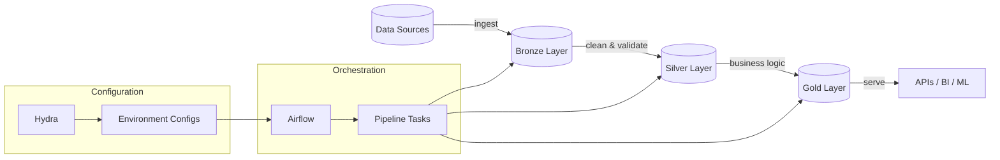

# {{cookiecutter.project_name}}

A modern data engineering project with Airflow, dbt, PostgreSQL, and Hydra configuration management.

**Generated from**: [Data Engineering Template](https://github.com/your-org/data-eng-template)  
**Author**: {{cookiecutter.author_name}}

## 🚀 Quick Start

### Option 1: Optimized Setup (Recommended)
```bash
# One-command setup with performance optimization
./scripts/setup-development.sh
```

This script automatically:
- Installs enhanced development tooling (`devcontainer-service-manager`)
- Applies workstation performance optimizations (149x faster builds)
- Configures cross-repository Docker caching
- Starts optimized development services

### Option 2: VS Code DevContainer
```bash
# Open in VS Code DevContainer
code .
# Click "Reopen in Container" when prompted
```

### Option 3: Manual Setup
```bash
uv sync && ./scripts/export_env.sh > .env
cd .devcontainer && docker compose up -d
```

**Access Points**:
- **Airflow UI**: http://localhost:8081 (admin/admin)
- **Database**: localhost:5432 (postgres/postgres)

**Performance Benefits** (with optimized setup):
- 149x faster Docker builds via fingerprint caching
- Cross-repository cache sharing
- WSL2 performance optimizations
- Automated resource cleanup

## 📚 Documentation

- **🏠 Start here**: [`docs/index.md`](docs/index.md) - Complete documentation homepage
- **🚀 Getting started**: [`docs/getting-started.md`](docs/getting-started.md) - Setup and first steps
- **📁 Project structure**: [`docs/directory_structure.md`](docs/directory_structure.md) - What's where
- **⚙️ Configuration**: [`docs/configuration/README.md`](docs/configuration/README.md) - Hydra config system
- **🔧 Pipelines**: [`docs/pipelines/README.md`](docs/pipelines/README.md) - Data processing architecture  
- **🚀 Operations**: [`docs/operations/README.md`](docs/operations/README.md) - Running and deploying
- **❓ FAQ**: [`docs/faq.md`](docs/faq.md) - Common questions and solutions

## ⚡ Key Features

### 🏗️ Modern Architecture
- **Medallion data layers** (Bronze → Silver → Gold)
- **Hydra configuration** with type-safe Pydantic models
- **DevContainer development** with one-command setup
- **Apache Airflow** orchestration with best practices

### 🛠️ Developer Experience  
- **Type-safe configuration** - Full IDE support with validation
- **Distributed AI guidance** - `CLAUDE.md` files provide contextual help
- **Test-driven development** - Comprehensive test suite included
- **Zero-config startup** - Open in DevContainer and start coding

### 🔧 Configuration System

Uses **Hydra** for unified configuration management:

```bash
# Development (default)
python scripts/run_pipeline.py

# Production with overrides  
python scripts/run_pipeline.py environment=prod database.host=prod-db.com

# Debug mode
python scripts/run_pipeline.py runtime.debug_mode=true runtime.dry_run=true
```

## 📊 Data Pipeline



## 🏃‍♂️ Common Tasks

```bash
# Run pipeline with dry-run
python scripts/run_pipeline.py runtime.dry_run=true

# dbt development
cd dbt && dbt run --target dev && dbt test

# Database access
./scripts/psql.sh

# Run tests
make test

# Generate documentation
cd dbt && dbt docs generate && dbt docs serve
```

## 🗂️ Project Structure

```
├── conf/                    # Hydra configuration system
├── dags/                    # Airflow DAG definitions  
├── dbt/                     # Data transformations (medallion architecture)
├── scripts/                 # Operational utilities
├── transforms/              # SQLModel/Pydantic data models
├── tests/                   # Test suite
├── docs/                    # This documentation
└── .devcontainer/           # VS Code DevContainer setup
```

## 🤝 Contributing

See [CONTRIBUTING.md](CONTRIBUTING.md) for development guidelines.

## 📜 License

See [LICENSE](LICENSE) for licensing information.

---

**Need help?** Check the [FAQ](docs/faq.md) or [full documentation](docs/index.md).