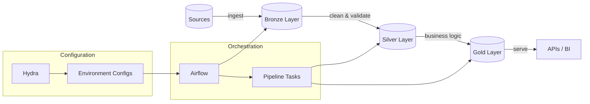

# {{cookiecutter.project_name}} Documentation

Welcome! This data engineering project template is designed to be cloned, forked, and customized. Everything here is GitHub-native Markdown with relative links, so it works perfectly in public forks, internal mirrors, and offline browsing.

## Quick Navigation

- **🚀 Getting started:** [`getting-started.md`](getting-started.md)
- **📁 Project structure:** [`directory_structure.md`](directory_structure.md)
- **⚙️ Configuration:** [`configuration/`](configuration/) - Hydra configuration system
- **🔧 Pipelines:** [`pipelines/`](pipelines/) - Data flow and processing
- **🚀 Operations:** [`operations/`](operations/) - Development and deployment
- **📋 Architecture decisions:** [`adr/`](adr/) - Technical decision records

## What's Inside

This template provides a complete data engineering setup with:

### 🏗️ Modern Architecture
- **Medallion data architecture** (Bronze → Silver → Gold layers)
- **Hydra configuration management** with type-safe Pydantic models
- **Containerized development** with VS Code DevContainers
- **Airflow orchestration** with best practices

### 🛠️ Developer Experience
- **One-command setup** - Open in DevContainer and start coding
- **Distributed AI guidance** - `CLAUDE.md` files provide contextual help
- **Type-safe configuration** - Full IDE support with validation
- **Test-driven development** - Comprehensive test suite included

### 📊 Data Pipeline Components
- **dbt transformations** with medallion layer organization
- **SQLModel data models** for type-safe data processing  
- **Airflow DAGs** with examples and patterns
- **PostgreSQL** as the analytical database

## Configuration Philosophy

This project uses **Hydra for unified configuration management**, replacing traditional `.env` files with:

- **Hierarchical configs** - Environment-specific overrides
- **Type safety** - Pydantic validation with IDE support
- **Self-documenting** - Inline comments explain all options
- **Runtime flexibility** - Command-line overrides without file edits

```bash
# Run with development settings (default)
python scripts/run_pipeline.py

# Override for production
python scripts/run_pipeline.py environment=prod

# Specific overrides
python scripts/run_pipeline.py database.host=prod-db.com runtime.parallel_jobs=8
```

## Documentation Strategy

This documentation follows GitHub-native patterns:

- **Portable Markdown** - Works in forks, mirrors, and offline
- **Relative links** - No broken links when repo is moved
- **Folder-level READMEs** - Automatic GitHub rendering
- **Mermaid diagrams** - Native GitHub diagram support
- **ADR pattern** - Architecture Decision Records for context

## Mermaid Diagram Example



## Quick Links

- [Getting Started Guide](getting-started.md) - Set up your development environment
- [Pipeline Overview](pipelines/README.md) - Understanding data flow
- [Configuration Guide](configuration/README.md) - Managing environments
- [Operations Guide](operations/README.md) - Running and deploying
- [FAQ](faq.md) - Common questions and troubleshooting

---

**Generated by**: [Data Engineering Template](https://github.com/your-org/data-eng-template)  
**Author**: {{cookiecutter.author_name}}  
**License**: See [LICENSE](../LICENSE)