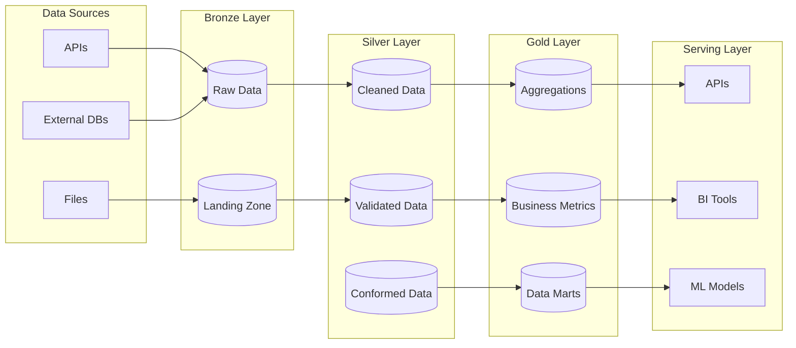

# Data Pipelines

Overview of data pipelines and processing architecture for {{cookiecutter.project_name}}.

## Pipeline Architecture

This project follows the **Medallion Architecture** pattern for data processing:



## Layer Responsibilities

### Bronze Layer (Raw Data Ingestion)
- **Purpose**: 1:1 copy of source data with minimal processing
- **Characteristics**: 
  - Preserves original data types and structure
  - Adds ingestion metadata (timestamp, source, batch_id)
  - No business logic or transformations
  - Optimized for fast ingestion and storage

**Example Bronze Model**:
```sql
-- models/bronze/bronze_events.sql
{{ config(materialized='table') }}

SELECT 
    *,
    '{{ var("batch_id") }}' as _batch_id,
    CURRENT_TIMESTAMP as _ingested_at,
    '{{ var("source_system") }}' as _source_system
FROM {{ source('events', 'raw_events') }}
```

### Silver Layer (Cleaned & Validated)
- **Purpose**: Cleaned, validated, and standardized data
- **Characteristics**:
  - Data type conversions and standardization
  - Data quality validation and cleansing
  - Deduplication and error handling
  - Consistent naming conventions
  - Still close to source structure

**Example Silver Model**:
```sql
-- models/silver/silver_events.sql
{{ config(materialized='view') }}

SELECT 
    event_id,
    CAST(event_timestamp AS timestamp) as event_timestamp,
    LOWER(TRIM(event_type)) as event_type,
    user_id,
    properties,
    _batch_id,
    _ingested_at,
    _source_system
FROM {{ ref('bronze_events') }}
WHERE event_id IS NOT NULL
  AND event_timestamp IS NOT NULL
```

### Gold Layer (Business-Ready)
- **Purpose**: Business logic, aggregations, and analytics-ready data
- **Characteristics**:
  - Complex business rules and calculations
  - Cross-domain data joining
  - Aggregations and summaries
  - Optimized for analytics and reporting
  - Domain-specific data marts

**Example Gold Model**:
```sql
-- models/gold/daily_user_activity.sql
{{ config(materialized='table') }}

SELECT 
    user_id,
    DATE(event_timestamp) as activity_date,
    COUNT(*) as total_events,
    COUNT(DISTINCT event_type) as unique_event_types,
    MIN(event_timestamp) as first_event_time,
    MAX(event_timestamp) as last_event_time
FROM {{ ref('silver_events') }}
WHERE event_timestamp >= CURRENT_DATE - INTERVAL '30 days'
GROUP BY user_id, DATE(event_timestamp)
```

## Orchestration with Airflow

Data pipelines are orchestrated using Apache Airflow with the following patterns:

### DAG Structure

```python
# dags/daily_pipeline.py
from airflow import DAG
from airflow.operators.python_operator import PythonOperator
from airflow.operators.bash_operator import BashOperator
from datetime import datetime, timedelta

default_args = {
    'owner': '{{cookiecutter.author_name}}',
    'depends_on_past': False,
    'start_date': datetime(2025, 1, 1),
    'retries': 1,
    'retry_delay': timedelta(minutes=5)
}

dag = DAG(
    'daily_data_pipeline',
    default_args=default_args,
    description='Daily medallion architecture pipeline',
    schedule_interval='@daily',
    catchup=False
)

# Bronze layer ingestion
ingest_bronze = PythonOperator(
    task_id='ingest_bronze_data',
    python_callable=ingest_raw_data,
    dag=dag
)

# Silver layer processing  
process_silver = BashOperator(
    task_id='process_silver_layer',
    bash_command='cd dbt && dbt run --models silver',
    dag=dag
)

# Gold layer aggregation
process_gold = BashOperator(
    task_id='process_gold_layer', 
    bash_command='cd dbt && dbt run --models gold',
    dag=dag
)

# Data quality tests
run_tests = BashOperator(
    task_id='run_data_quality_tests',
    bash_command='cd dbt && dbt test',
    dag=dag
)

# Define dependencies
ingest_bronze >> process_silver >> process_gold >> run_tests
```

### Task Patterns

- **Ingestion Tasks**: Python operators for API calls, file processing
- **Transformation Tasks**: Bash operators calling dbt commands
- **Quality Tasks**: dbt test execution and custom validation
- **Notification Tasks**: Alerting on failures or completion

## Configuration-Driven Pipelines

Pipelines are configured using the Hydra configuration system:

```python
# scripts/run_pipeline.py
@hydra.main(config_path="../conf", config_name="config")
def main(cfg: DictConfig) -> None:
    settings = get_settings()
    
    # Configure based on environment
    if settings.runtime.dry_run:
        logger.info("DRY RUN MODE - No actual processing")
        
    # Run pipeline with configuration
    pipeline = DataPipeline(
        parallel_jobs=settings.runtime.parallel_jobs,
        target_environment=settings.transformations.profile.target
    )
    
    pipeline.run()
```

**Configuration Example**:
```bash
# Development run
python scripts/run_pipeline.py

# Production run with overrides
python scripts/run_pipeline.py environment=prod runtime.parallel_jobs=16

# Dry run for testing
python scripts/run_pipeline.py runtime.dry_run=true
```

## Data Quality Framework

### dbt Tests

```sql
-- tests/assert_valid_events.sql
SELECT *
FROM {{ ref('silver_events') }}
WHERE event_timestamp > CURRENT_DATE + INTERVAL '1 day'
   OR event_timestamp < '2020-01-01'
```

### Custom Validation

```python
# transforms/validators.py
from pydantic import BaseModel, validator

class EventRecord(BaseModel):
    event_id: str
    event_timestamp: datetime
    event_type: str
    
    @validator('event_type')
    def validate_event_type(cls, v):
        allowed_types = ['click', 'view', 'purchase', 'signup']
        if v not in allowed_types:
            raise ValueError(f'Invalid event type: {v}')
        return v
```

## Monitoring and Observability

### Pipeline Monitoring

- **Airflow UI**: DAG run status, task duration, failure rates
- **dbt docs**: Data model documentation and lineage
- **Custom metrics**: Data volume, quality scores, processing time

### Alerting

```python
# dags/utils/notifications.py
def notify_on_failure(context):
    """Send notification on pipeline failure."""
    dag_id = context['dag'].dag_id
    task_id = context['task_instance'].task_id
    
    # Send to monitoring system
    send_alert(f"Pipeline {dag_id}.{task_id} failed")
```

## Performance Optimization

### dbt Optimization

```yaml
# dbt_project.yml
models:
  my_project:
    bronze:
      +materialized: table
      +indexes: ['event_timestamp', 'user_id']
      
    silver: 
      +materialized: view  # Fast compilation
      
    gold:
      +materialized: table
      +post-hook: "ANALYZE TABLE {{ this }}"
```

### Airflow Optimization

- **Parallelism**: Configure based on resource availability
- **Pool usage**: Limit concurrent resource-intensive tasks  
- **XCom optimization**: Minimize data passed between tasks
- **Connection pooling**: Reuse database connections

## Further Reading

- [Configuration Guide](../configuration/README.md) - Hydra configuration management
- [Operations Guide](../operations/README.md) - Deployment and testing
- [dbt Modeling Guide](../../dbt/CLAUDE.md) - Specific dbt patterns
- [Airflow DAG Guide](../../dags/CLAUDE.md) - DAG development patterns